#.1.
```
 CREATE TABLE DEPT
(
    DNO NUMBER PRIMARY KEY,
    DNAME VARCHAR2(30) NOT NULL
);
```

```
```

#.2.
```
CREATE TABLE STUDENT5
(
    SID NUMBER PRIMARY KEY,
    SNAME VARCHAR2(30) NOT NULL,
    DID NUMBER
    );
```

```
```
    
#.3.
```
ALTER TABLE STUDENT5
ADD CONSTRAINT FK_DID
FOREIGN KEY(DID)
REFERENCES DEPT(DNO);
```

```
```
#.4.
```
BEGIN
  EXECUTE IMMEDIATE 'DROP TABLE STUDENT5 CASCADE CONSTRAINTS';
EXCEPTION WHEN OTHERS THEN NULL;
END;
/

CREATE TABLE STUDENT5 (
  SID NUMBER PRIMARY KEY,
  SNAME VARCHAR2(20) NOT NULL,
  DID NUMBER
);
```

```
```

#.5.
```
INSERT INTO DEPT VALUES (10, 'CSE');
INSERT INTO DEPT VALUES (20, 'ME');
INSERT INTO DEPT VALUES (30, 'CE');
INSERT INTO DEPT VALUES (40, 'EEE');
INSERT INTO DEPT VALUES (50, 'ECE');
INSERT INTO DEPT VALUES (60, 'CSM');
INSERT INTO DEPT VALUES (70, 'CSD');
```
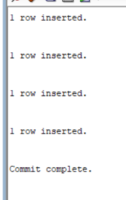
```
```
#.6.
```
INSERT INTO STUDENT5 VALUES (101, 'Rahul', 10);
INSERT INTO STUDENT5 VALUES (102, 'Sneha', 20);
INSERT INTO STUDENT5 VALUES (103, 'Arjun', 10);
INSERT INTO STUDENT5 VALUES (104, 'Priya', 30);
INSERT INTO STUDENT5 VALUES (105, 'Kiran', 40);
INSERT INTO STUDENT5 VALUES (106, 'Nikhil', 50);
INSERT INTO STUDENT5 VALUES (107, 'Anjali', 60);
INSERT INTO STUDENT5 VALUES (108, 'Ravi', 10);
INSERT INTO STUDENT5 VALUES (109, 'Pooja', 20);
INSERT INTO STUDENT5 VALUES (110, 'Aman', NULL);
```
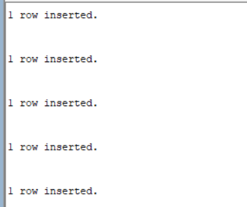
```
```

#.7.
```
SELECT SID, SNAME, DNO, DNAME
FROM STUDENT5 S
JOIN DEPT D
ON S.DID=D.DNO;

SELECT * FROM STUDENT5;
SELECT * FROM DEPT;
```
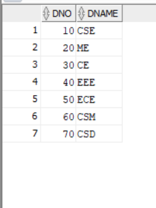
```
```
#.8.
```
SELECT S.SID,
       S.SNAME,
       D.DNO,
       D.DNAME
FROM STUDENT5 S
INNER JOIN DEPT D
ON S.DID = D.DNO;
```
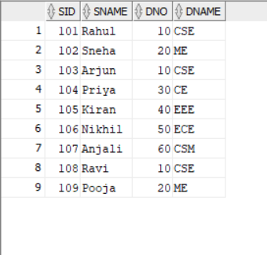
```
```

#.9.
```
SELECT S.SID,
       S.SNAME,
       D.DNO,
       D.DNAME
FROM STUDENT5 S
JOIN DEPT D
ON S.DID > D.DNO;
```
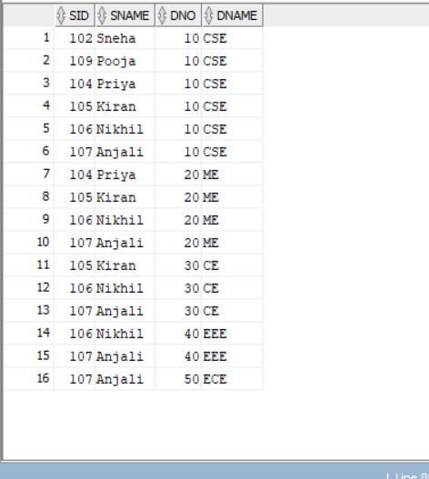
```
```
#.10.
```
SELECT S.SID,
       S.SNAME,
       S.DID,
       D.DNAME
FROM STUDENT5 S
LEFT OUTER JOIN DEPT D
ON S.DID = D.DNO;
```
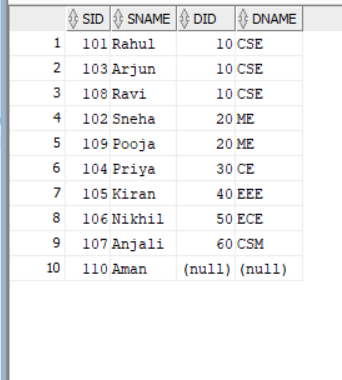
```
```
#.11.
```
SELECT S.SID,
       S.SNAME,
       D.DNO,
       D.DNAME
FROM STUDENT5 S
RIGHT OUTER JOIN DEPT D
ON S.DID = D.DNO;
```
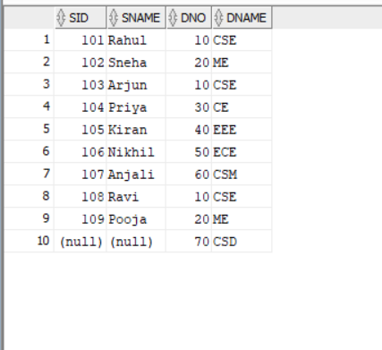
```
```
#.12.
```
SELECT S.SID,
       S.SNAME,
       D.DNO,
       D.DNAME
FROM STUDENT5 S
FULL OUTER JOIN DEPT D
ON S.DID = D.DNO;
```
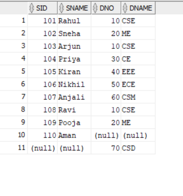
```
```
#.13.
```
SELECT S.SID,
       S.SNAME,
       D.DNAME
FROM STUDENT5 S
LEFT OUTER JOIN DEPT D
ON S.DID = D.DNO;
```
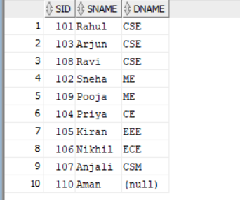
```
```

#.14.
```
SELECT S.SID,
       S.SNAME,
       D.DNAME
FROM STUDENT5 S
RIGHT OUTER JOIN DEPT D
ON S.DID = D.DNO;
```
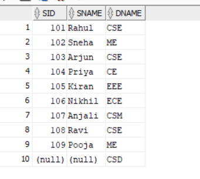
```
```
#.15.
```
SELECT S.SID,
       S.SNAME,
       D.DNAME
FROM STUDENT5 S
FULL OUTER JOIN DEPT D
ON S.DID = D.DNO;
```
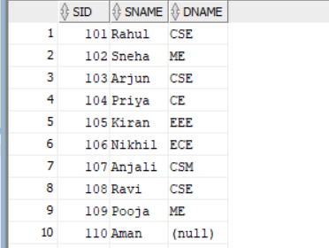
```
```
#.16.
```
SELECT S.SID,
       S.SNAME,
       D.DNO,
       D.DNAME
FROM STUDENT5 S
LEFT OUTER JOIN DEPT D
ON S.DID >= D.DNO;
```
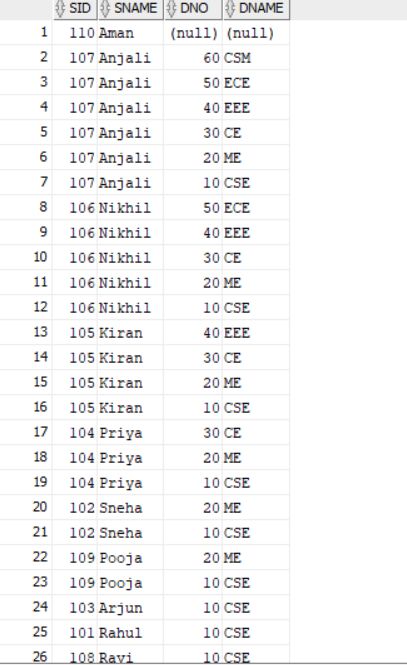
```
```
#.17.
```
SELECT S.SID,
       S.SNAME,
       D.DNO,
       D.DNAME
FROM STUDENT5 S
RIGHT OUTER JOIN DEPT D
ON S.DID >= D.DNO;
```
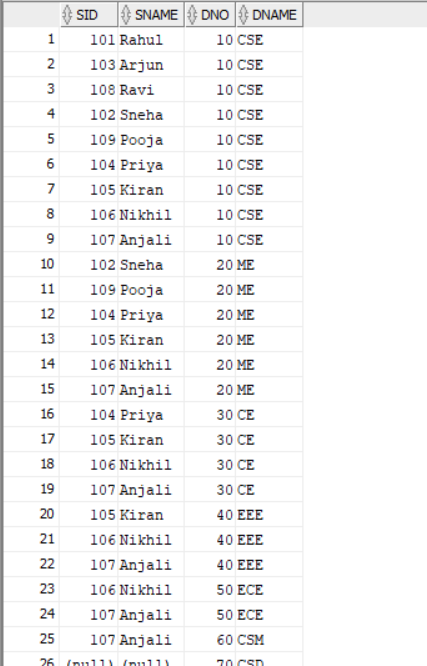
```
```
#.18.
```
SELECT S.SID,
       S.SNAME,
       D.DNO,
       D.DNAME
FROM STUDENT5 S
FULL OUTER JOIN DEPT D
ON S.DID >= D.DNO;
```
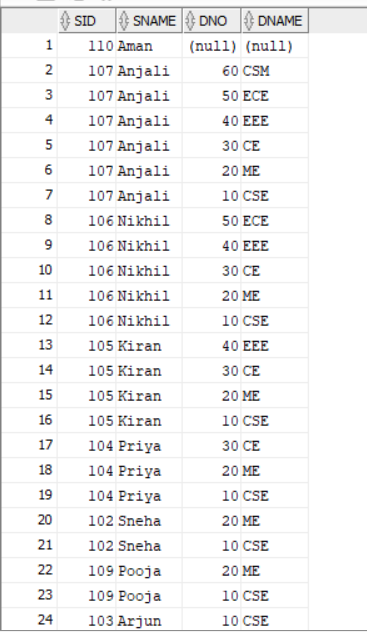
```
```
#.19.
```
SELECT S.SID,
       S.SNAME,
       D.DNO,
       D.DNAME
FROM STUDENT5 S
CROSS JOIN DEPT D;
```
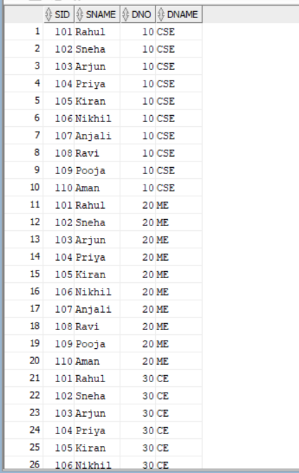
```
```
