## DROP TABLE student;
```
  CREATE TABLE student(
 name VARCHAR2(30),
 student_number NUMBER,
 class NUMBER,
 major VARCHAR2(20)
);
```
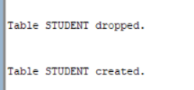
```
```
## DESCRIBE STUDENT TABLE
```
DESC student;
```

## INSERTING VALUES INTO STUDENT TABLE
``` 
INSERT INTO student
VALUES('smith',17,1,'cs');
INSERT INTO student
VALUES('brown',8,2,'cs');
SELECT * FROM student;

```

```
```
## DROP TABLE section CASCADE CONSTRAINTS;
```
CREATE TABLE section(
 section_identifier NUMBER,
 course_number NUMBER,
 semester VARCHAR2(10),
 year NUMBER,
 instructor VARCHAR2(30)
);
```
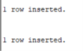
```
```
## DESCRIBE SECTION TABLE
```
DESC Section;
```
## INSERT SECTION TABLE
``` 
INSERT INTO section
VALUES(85,'MATH2410','fall',2007,'king');
INSERT INTO section
VALUES(92,'cS310','fall',2007,'anderson');
INSERT INTO section
VALUES(102,'cs3320','spring',2008,'knuth');
INSERT INTO section
VALUES(112,'math2410','fall',2008,'chang');
INSERT INTO section
VALUES(119,'cs1310','fall',2008,'anderson');
INSERT INTO section
VALUES(135,'cs3380','fall',2008,'stone');
SELECT * FROM section;

```
## DISPLAY SECTION TABLE
```
DROP TABLE grade_report CASCADE CONSTRAINTS;
DROP TABLE section CASCADE CONSTRAINTS;
DROP TABLE student CASCADE CONSTRAINTS;
DROP TABLE course CASCADE CONSTRAINTS;
DROP TABLE prerequisite CASCADE CONSTRAINTS;

CREATE TABLE grade_report(
 student_number NUMBER,
 section_identifier NUMBER,
 grade VARCHAR2(20)
);
```
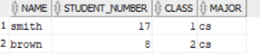
```
```
## DESCRIBE GRADE_REPORT TABLE
```
DESC grade_report1;
```
## INSERT GRADE_REPORT TABLE
```
INSERT INTO grade_report1
VALUES(17,112,'B');
INSERT INTO grade_report1
VALUES(17,119,'C');
INSERT INTO grade_report1
VALUES(8,85,'A');
INSERT INTO grade_report1
VALUES(8,92,'A');
INSERT INTO grade_report1
VALUES(8,102,'B');
INSERT INTO grade_report1
VALUES(8,135,'A');

```
## DISPLAY GRADE_REPORT TABLE
```
SELECT * FROM grade_report1;
```
## CREATE COURSE TABLE
```
CREATE TABLE course(
course_name VARCHAR2(50),
course_number NUMBER,
credit_hours NUMBER,
department VARCHAR2(20)
);
```
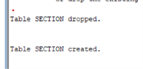
```
```
## DESCRIBE COURSE TABLE
```
DESC course;
```
## INSERT COURSE TABLE
```
INSERT INTO course
VALUES('intro to computer science',1301,4,'cs');
INSERT INTO course
VALUES('data structures',1321,4,'cs');
INSERT INTO course
VALUES('discrete mathematics',2302,3,'math');
INSERT INTO course
VALUES('data base',3380,3,'cs');
```
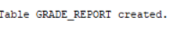
```
```

## 1.Implement the tables using above contraints
```
CREATE TABLE Student(
Name VARCHAR2(30),
Student_number NUMBER PRIMARY KEY,
Class NUMBER,
Major VARCHAR2(50) );

CREATE TABLE Course (
Course_Name VARCHAR2(20),
Course_Number NUMBER PRIMARY KEY,
Credit_Hours NUMBER,
Department VARCHAR2(30) );

CREATE TABLE Section(
Section_Identifier NUMBER PRIMARY KEY,
Course_Number NUMBER,
Semester VARCHAR2(20),
Year NUMBER,
Instructor VARCHAR2(40),
FOREIGN KEY(Course_Number) REFERENCES Course(course_Number) );

CREATE TABLE Grade_Report(
Student_Number NUMBER,
Section_Identifier NUMBER,
Grade CHAR(2),
PRIMARY KEY(Student_Number,Section_Identifier),
FOREIGN KEY(Student_Number) REFERENCES Student(Student_Number),
FOREIGN KEY(Section_Identifier) REFERENCES Section(Section_Identifier) );

CREATE TABLE Prerequisite(
Course_Number NUMBER,
Prerequisite_Number NUMBER,
PRIMARY KEY(Course_Number),
FOREIGN KEY(Course_Number) REFERENCES Course(Course_Number) );
```


```
```

## 2.Display the decription of each table
```
DESC Student;
DESC course;
DESC Section;
DESC Grade_Report;
DESC Prerequisite;
```

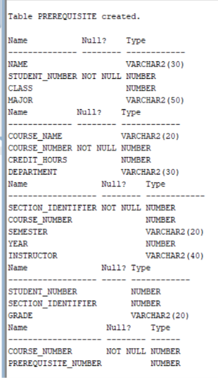
```
```

## 3.Insert the values specified by the above database
```
INSERT INTO Student VALUES('Smith',17,1,'CS'),('Brown',8,2,'CS'),('Jaylor',25,3,'Math');
INSERT INTO Course VALUES('INTRO-TO-CS',1301,3,'CS'),('DATA-STRUCTURE',1310,3,'CS'),('Database',3320,3,'CS');
INSERT INTO Section VALUES(85,1301,'FALL',2007,'King'),(92,1301,'FALL',2008,'Anderson'),(102,3320,'Spring',2008,'Knuth');
INSERT INTO Grade_Report VALUES(17,85,'A'),(8,92,'B'),(25,102,'A');
INSERT INTO prerequisite VALUES(1301,1301),(3320,1310);
COMMIT;
```

```
```

## 4.Display the instances of each table in the database
```
SELECT * FROM Student;
SELECT * FROM Course;
SELECT * FROM Section;
SELECT * FROM Grade_Report;
SELECT * FROM Prerequisite;
```


```
```

## 5.All branch attribute in student table and Describe the table
```
ALTER TABLE Student
ADD Branch VARCHAR2(20);
DESC Student;
```

```
```


## 6.Copy Major attribure values into branch attribute and display it
```
UPDATE Student
SET Branch = Major;
SELECT * FROM Student;
```

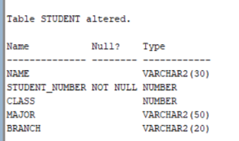
```
```

## 7.Remove the Major attribute in Student
```
ALTER TABLE Student
DROP COLUMN Major;
```
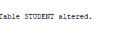
```
```
## 8.Change the name of Course_number to cid in course and describe it
```
ALTER TABLE Course
RENAME COLUMN Course_Number TO CID;
DESC Course;
```
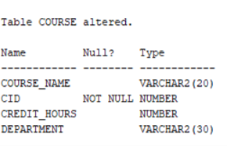
```
```
## 9.change the value of credit-hrs of database to 4 in course
```
UPDATE Course
SET Credit_Hrs = 4;
SELECT * FROM Course;
```

```
```
## 10.Put NOT NULL CONSTRAINT to column branch in student
```
ALTER TABLE Student
MODIFY BRANCH VARCHAR2(20) NOT NULL;
```

```
```
## 11.Replace the student table name to pupil
```
RENAME Student to pupil;
```

```
```
## 12.Remove the student table
```
DROP TABLE student;
```

```
```
## 13.Remove the rows of 'Fall' Semester in section
```
DELETE FROM Section
WHERE Semester = 'Fall';
COMMIT;
```

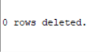
```
```
## 14.Remove the row of 'Data_structure' in Course
```
DELETE FROM Course
WHERE Course_Name = 'Data_Structure';
COMMIT;
```
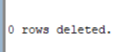
```
```
## 15.Remove all rows in all tables using TRUNCATE table
```
TRUNCATE TABLE Grade_Report;
TRUNCATE TABLE Prerequisite;
TRUNCATE TABLE Section;
TRUNCATE TABLE Course;
TRUNCATE TABLE Pupil;
```
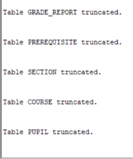
```
```
## 16.Remove pupil, course and section table so that it exist in recycle bin
```
DROP TABLE Pupil;
DROP TABLE Course;
DROP TABLE Section;
```
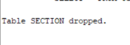
```
```
## 17.Remove Grade_Report & Prerequisites table permanently
```
DROP TABLE Grade_Report PURGE;
DROP TABLE Prerequisite PURGE;
```
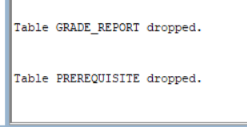
```
```
